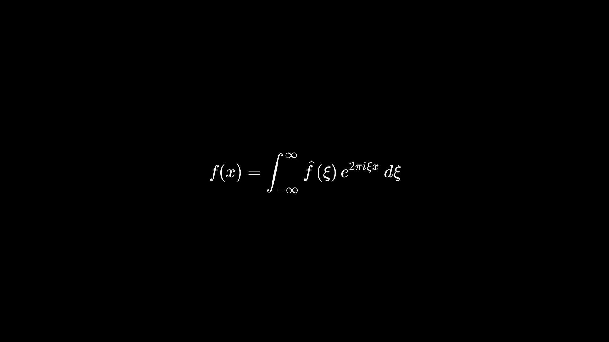

# Lucid

D3 SVG animations to MP4. Animations are constructed from a `scene`, which starts a server and headless browser. `scene`s need an HTML file, which contain the d3 code, with a pre-injected SVG and d3 already loaded:

```js
import scene from 'lucid';

scene(`${__dirname}/scene.html`)
  .duration(1500)
  .output(`${__dirname}/video.mp4`)
  .then(process.exit);
```

And in `scene.html`:

```html
<!DOCTYPE html>
<html>
  <body>
    <script>
      /**
       * Globals include:
       * - d3
       * - TIME (for current frame)
       * - WIDTH (of the mp4 and svg)
       * - HEIGHT
       * - pre-injected SVG (of WIDTH and HEIGHT)
       */
      window.onLucidStart = () => {
        const svg = d3.select('svg');
        const txt = svg.append('text')
          .text('Hello World!')
          .attr('text-anchor', 'middle')
          .attr('x', WIDTH / 2)
          .attr('y', HEIGHT / 2)
          .style('opacity', 0);
        
        txt.transition()
          .duration(1500)
          .style('opacity', 1)
          .on('end', () => {
            txt.text('Bye World!');

            txt.transition()
              .duration(1500)
              .style('opacity', 0);
          });
      }
    </script>
  </body>
</html>
```

Which will yield:



# Todo
- Multiple scenes
- Parallelize multi-scenes
- Better API